<h1 align="center">ROSSO</h1>

<p align="center"><strong>The Interactive Scuderia Ferrari F1 Garage</strong><br>
A cinematic 3D museum of Ferrari in Formula 1, from Ascari to Hamilton, built in the browser.</p>

<p align="center">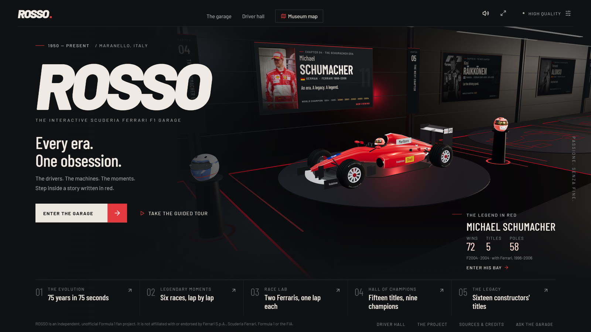</p>

ROSSO is a personal fan project: a digital museum you walk through rather than a website you scroll. Seventeen driver bays line a garage corridor, each with the driver's Ferrari, helmet and story. At either end are rooms for the cars' evolution, the drivers' champions and the constructors' titles. Six great races replay lap by lap, and a telemetry lab compares two Ferraris on one lap. Every number comes from a sourced dataset, and everything you see and hear is generated in code.

---

## A walk through the museum

### The garage

Seventeen bays, one for every Ferrari driver in the collection. Each shows the car from that driver's chosen season, their helmet, portrait and a board with their story. The season strip at the bottom opens every year of their career in red, with race results, key races and a link to watch or analyse the races that defined it. Move between bays with the arrows beside the driver's name; the camera glides to the next car.

<p align="center">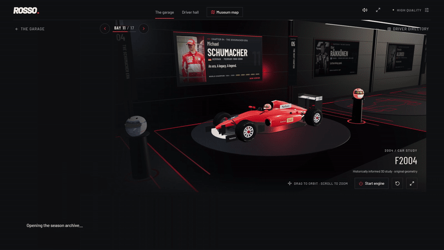</p>

### The Machine

Switch to **The Machine** to take the car apart. Nine components (front and rear wing, tyres, brakes, power unit, steering wheel, floor, diffuser and sidepods) separate on command, each with a plain-language explanation. You can isolate one part, or start the engine and hear a synthesised note based on that car's engine layout.

<p align="center">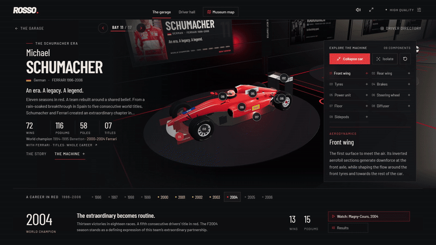</p>

### The Evolution: 75 years in 75 seconds

A room before the first bay plays twenty Ferraris from 1951 to 2026 on a turntable. Each car is a real driver-season, so its name, livery, race number and engine come from the data.

<p align="center">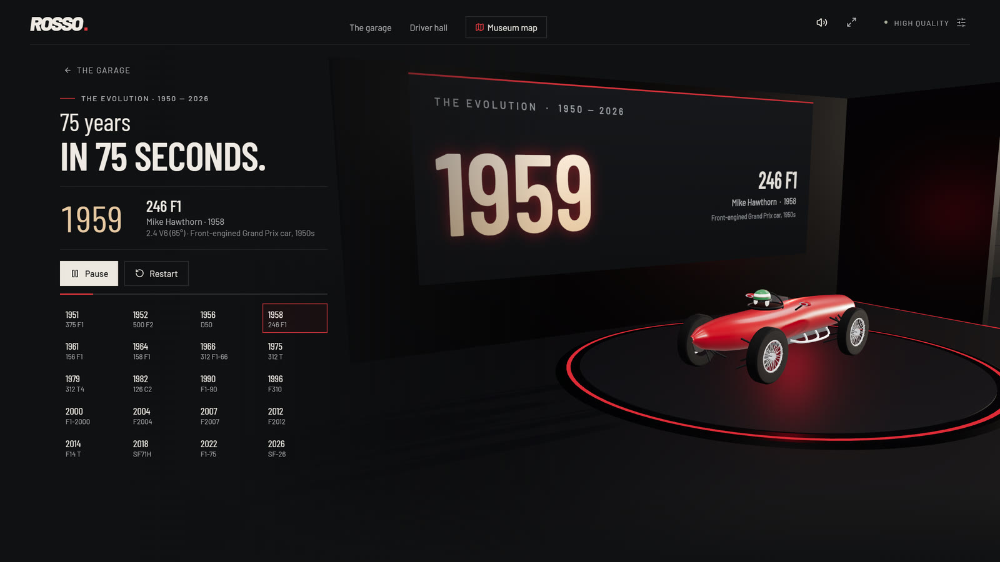</p>

### The Hall of Champions

The corridor ends in a gilded hall with a station for every Ferrari drivers' world champion: their helmet, one trophy per title and a plaque. Click a helmet or trophy to fly to that station and study it; click the plaque to open the driver's bay on a title season. The Ferrari shield turns slowly above a lit plinth at the centre of the floor.

<p align="center">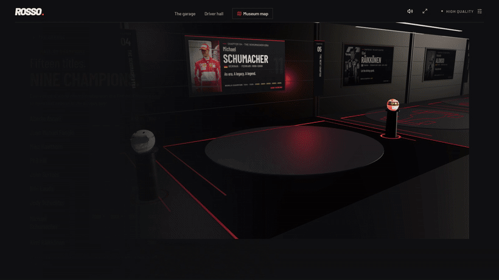</p>

<p align="center">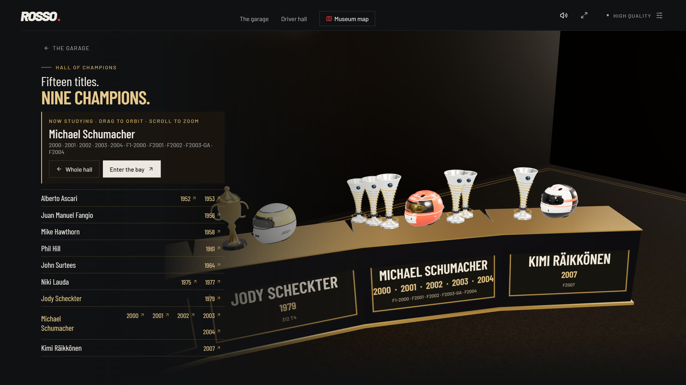</p>

### The Legacy

A red-lacquered room under a gilded 16 holds every constructors' championship. The eras before 1999 stand on a raised tier, the dream-team years in front. Choose a trophy to see that season's cars, points, drivers and the team behind it.

<p align="center">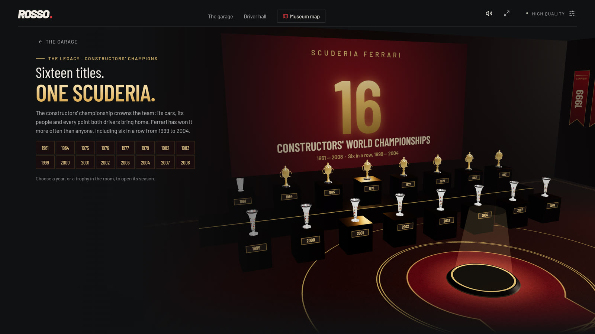</p>

### Legendary Moments

Six races replayed from the lap times recorded that day: Barcelona 1996, Suzuka 2000, Magny-Cours 2004, Interlagos 2007, Monza 2019 and Barcelona 2026. Cars move on the real circuit outline with a live timing tower and sourced captions. Watch at 0.5×, 1× or 2×, with trackside sound: a distant pack, cars passing, the crowd at the flag.

<p align="center">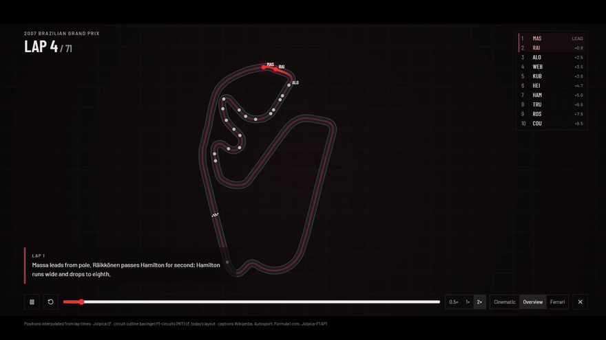</p>

<p align="center">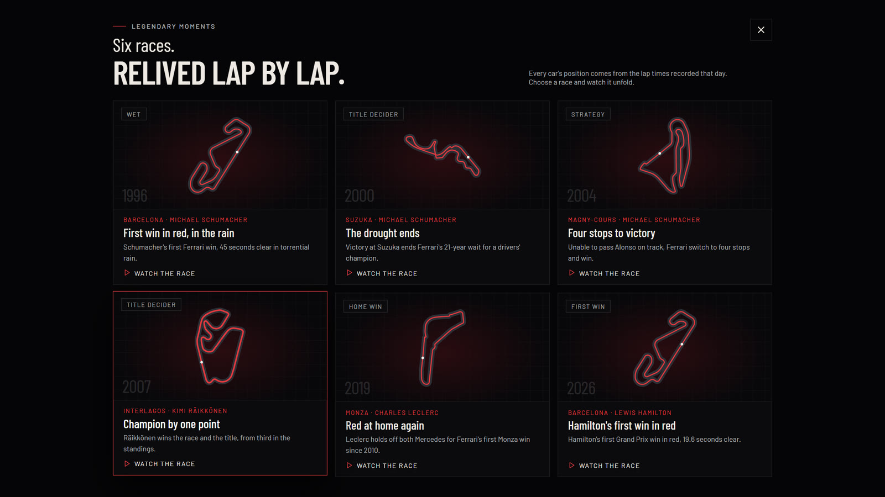</p>

### Race Lab

Measured telemetry for both Ferrari drivers' fastest qualifying laps in six sessions from 2023 to 2026. The track map is coloured by the faster driver in each mini-sector, with speed, throttle, brake, gear and the running gap stacked beside it, and a ghost replay you can scrub.

<p align="center">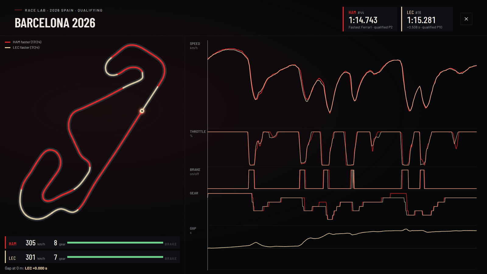</p>

### Finding your way

A museum map (press **M**) jumps to any room or bay, and a twelve-step guided tour visits the highlights. Esc closes anything.

<p align="center">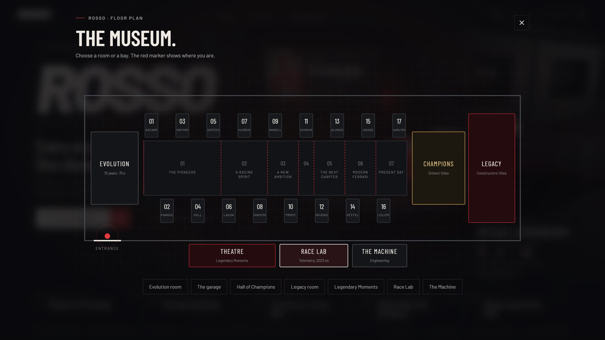</p>

---

## Features

- **One fixed frame.** The whole museum is composed at 1600 × 900 and scaled to fit, so every laptop and desktop sees the same picture with no page scroll. Phones get their own stacked layout.
- **Full screen.** The museum opens full screen when you enter it on a laptop or desktop; Esc returns to a normal window.
- **Sound, all synthesised.** Calm music in the garage and each room, engine notes voiced from each car's cylinder count, turbo and hybrid systems, and trackside sound for race replays. No audio files are downloaded.
- **Stay inside.** The camera can orbit and zoom freely but stops at the walls of each room.
- **Accessible.** Keyboard navigation, visible focus, HTML alternatives for every 3D hotspot, reduced-motion support and a 2D archive mode that works without WebGL.
- **Performance and High quality modes**, switchable in settings.

## Built with

[React 19](https://react.dev), TypeScript, [Vite](https://vite.dev), [three.js](https://threejs.org) with [React Three Fiber](https://r3f.docs.pmnd.rs) and [drei](https://github.com/pmndrs/drei), [zustand](https://github.com/pmndrs/zustand), the Web Audio API and [Lucide](https://lucide.dev) icons. There is no backend, database or API key: the data is bundled and the site is fully static.

## Run it locally

Requires Node.js 22.12 or later.

```sh
npm ci
npm run dev        # http://127.0.0.1:5173
npm test           # data reconciliation and model checks
npm run build      # type check and production build into dist/
npm run preview    # serve the production build
```

## Project structure

```text
src/
  App.tsx              Layout, navigation, landing page and dialogs
  app/                 Fixed stage, full screen, Esc handling
  scenes/Garage.tsx    The WebGL scene: lights, rooms, the current car
  3d/
    bays/              The corridor, bay boards and wall signs
    cars/              Procedural car families, liveries, exploded view
    helmets/           Painted helmet models
    rooms/             Evolution, Hall of Champions, Legacy, trophies, carpets
    camera/            Named poses and the director that owns camera motion
  features/            Guided tour, Evolution, Hall, Legacy, Moments, Race Lab, map
  audio/               Engine synth, room music, race soundscape
  data/                Drivers, results, cars, liveries, helmets, stories, sources
scripts/               Reproducible data imports and tests
```

## Performance

Measured on the production build with Intel UHD integrated graphics, the kind of GPU in an ordinary laptop, at 1600 × 900:

| | Performance mode | High quality |
|---|---|---|
| Orbiting a bay | 46 fps | 45 fps |
| Orbiting the Legacy room | 43 fps | 38 fps |
| Hall of Champions (shield turning) | 60 fps | 47 fps |
| Race replay | 60 fps | 60 fps |
| Download | 2.6 MB | 2.6 MB |

The scene renders only when something moves, so an idle page costs almost nothing.

## Data and sources

- **Results and standings:** [Jolpica F1](https://github.com/jolpica/jolpica-f1) (the Ergast successor), imported offline by `scripts/fetch-history.mjs`, up to 25 September 2026. Wins and podiums count Grand Prix classifications only, not sprints.
- **Telemetry:** [OpenF1](https://openf1.org), resampled along each lap by `scripts/fetch-racelab.mjs`.
- **Circuit outlines:** [bacinger/f1-circuits](https://github.com/bacinger/f1-circuits) (MIT).
- **Career titles, poles, cars, liveries, helmets and stories:** researched against Ferrari, Formula 1 and other cited sources; every entry records its references in `src/data`.
- **Portraits and race photographs:** Wikimedia Commons, each under its own licence (public domain, CC0, CC BY or CC BY-SA). The creator, licence and source of every image are listed in the site under **Sources & credits**.
- **Ferrari marks:** the [Ferrari wordmark](https://commons.wikimedia.org/wiki/File:Ferrari_wordmark.svg) (public domain as a text logo) and a [photograph of the Ferrari shield badge](https://commons.wikimedia.org/wiki/File:Ferrari_F430_EngineLogo_Scudetto_rosso_noBG.png) by Auge=mit (CC BY-SA 4.0; resized and shadow removed, adaptation shared under the same licence), both from Wikimedia Commons. Both remain trademarks of Ferrari S.p.A. Details in [`public/brand/CREDITS.txt`](public/brand/CREDITS.txt).

Cars, helmets and trophies are original procedural models: historically informed interpretations, not replicas. Sponsor names on the cars are set as plain type, not reproduced logo artwork.

## Credits

Typography: [Barlow and Barlow Condensed](https://github.com/jpt/barlow) (SIL Open Font License), bundled via Fontsource. Icons: [Lucide](https://lucide.dev/license) (ISC).

---

<p align="center"><sub>ROSSO is an independent, unofficial Formula 1 fan project. It is not affiliated with or endorsed by Ferrari S.p.A., Scuderia Ferrari, Formula 1 or the FIA.</sub></p>
